# Enterprise Network Architecture & Implementation (Network-1 Project)

 


**Faculty of Computing and Artificial Intelligence**
**Capital University** *~(Formerly Helwan University)*

**Course:** Computer Networks 1 (IT-222)  
**Instructor:** Doctor Islam Zakaria
**Academic Year:** 2025/2026

---

## 1. VLSM Chart (Subnetting Math)
**Base Network Address:** `192.168.1.0/24`

| Network / Branch | Hosts | Network ID | Subnet Mask | First Usable IP | Last Usable IP | Broadcast |
| :--- | :--- | :--- | :--- | :--- | :--- | :--- |
| **Local Office (VLAN 10)** | 60 | `192.168.1.0` | `255.255.255.192` | `192.168.1.1` | `192.168.1.62` | `192.168.1.63` |
| **Local Office (VLAN 20)** | 60 | `192.168.1.64` | `255.255.255.192` | `192.168.1.65` | `192.168.1.126`| `192.168.1.127`|
| **State HQ (Main)** | 20 | `192.168.1.128`| `255.255.255.224` | `192.168.1.129` | `192.168.1.158`| `192.168.1.159`|
| **Security Branch** | 14 | `192.168.1.160`| `255.255.255.240` | `192.168.1.161` | `192.168.1.174`| `192.168.1.175`|
| **Data Center (Servers)** | 2 | `192.168.1.176`| `255.255.255.248` | `192.168.1.177` | `192.168.1.182`| `192.168.1.183`|
| **WAN Link 1 (DC ↔ Sec)** | 2 | `192.168.1.184`| `255.255.255.252` | `192.168.1.185` | `192.168.1.186`| `192.168.1.187`|
| **WAN Link 2 (Sec ↔ HQ)** | 2 | `192.168.1.188`| `255.255.255.252` | `192.168.1.189` | `192.168.1.190`| `192.168.1.191`|
| **WAN Link 3 (HQ ↔ Local)**| 2 | `192.168.1.192`| `255.255.255.252` | `192.168.1.193` | `192.168.1.194`| `192.168.1.195`|

---

## 2. IP Mapping
A clear audit of the address space usage across the topology.

### Private IPs (Internal LANs)
* `192.168.1.0/26` & `192.168.1.64/26`: End users in the Local Office.
* `192.168.1.128/27`: State HQ workstations.
* `192.168.1.160/28`: Security branch devices.
* `192.168.1.176/29`: Web Server (`.179`) and DNS Server (`.178`).

### Public IPs (Simulated WAN & NAT)
* **WAN Serial Links:** `/30` subnets (`192.168.1.184`, `.188`, `.192`) simulate the ISP public routing infrastructure.
* **NAT Outside Interface:** The interface `Serial 0/1/0` on the Local Office Router (`192.168.1.194`) is mapped as the overload public IP for internal network translation.

---

## 3. Device & Connection Specifications
* **3.1. Hardware Details:**
  * **3.1.1. Routers:** 4x Cisco ISR 4331 (Local Office, State HQ, Security, Data Center).
  * **3.1.2. Switches:** 6x Cisco Catalyst 2960-24TT (Includes PortFast configuration).
  * **3.1.3. End Devices:** PC-PT (Clients) and Server-PT (Web/DNS).
* **3.2. Software:** Cisco IOS.
* **3.3. Cabling:**
  * **3.3.1. Copper Straight-Through:** Connecting PCs/Servers to Switches, and Switches to Router GigabitEthernet ports.
  * **3.3.2. Serial DCE/DTE:** Interconnecting the 4 routers across the WAN links.

---

## 4. Protocol Documentation Map
* **4.1. DHCP (Dynamic Host Configuration Protocol):** Centralized on the **State HQ Router**. Relayed via `ip helper-address` for VLAN 10 and 20.
* **4.2. NAT / PAT (Port Address Translation):** Configured on the **Local Office Router**. Translates multiple inside local addresses (VLANs) to a single inside global address (`S0/1/0`).
* **4.3. VLANs & Router-on-a-Stick:** Applied on the **Local Office Router** and Switch 4 (Trunking). `g0/0/1.10` and `g0/0/1.20` act as gateways.
* **4.4. Site-to-Site VPN (IPsec):** Established between the **Security Router** and **Data Center Router** to encrypt traffic passing over the simulated WAN.

---

## 5. Routing Table Proof

### 5.1. Full Topology
> *On any PC*
```cisco
ping 192.168.1.179
```

### 5.2. Router IP Config. 
> *On any Router*
```cisco
show ip interface brief
```

### 5.3. DHCP
>*ON State HQ Router*
```cisco
show ip dhcp pool
```

### 5.4. VLAN table 
> *ON Switch 4*
```cisco
show vlan brief
```

### 5.5. NAT translation table
> *ON Local Office Router*
```cisco
show ip nat translations
```

### 5.6. VPN status
> *ON Security Router || Data Center*
```cisco
show crypto isakmp sa
```

```cisco
show crypto ipsec sa
```

### 5.7. Routing table from each router 
> *ON all Routers*
```cisco
show ip route
```

---

## 6. Screenshots

### 6.1. Full Project
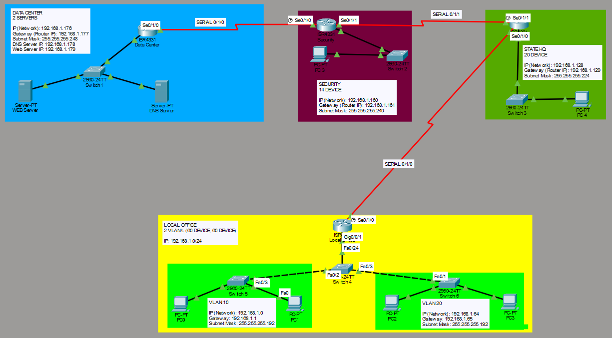

- 6.1.1. Local Office
    - 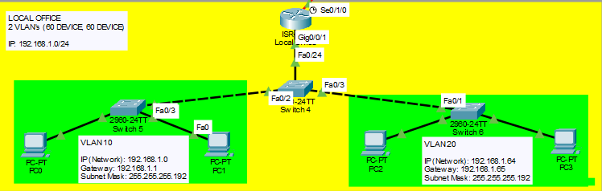

- 6.1.2. StateHQ
    - 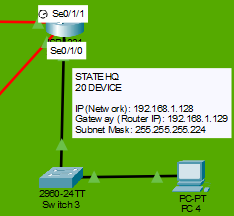

- 6.1.3. Security Dept.  
    - 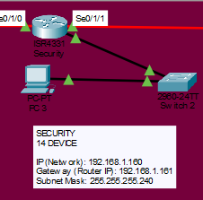

- 6.1.4. Data Center
    - 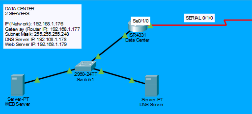

### 6.2. WEB Page
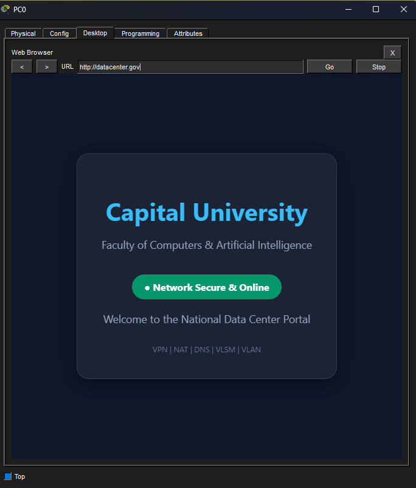

### 6.3. Router IP Interfaces
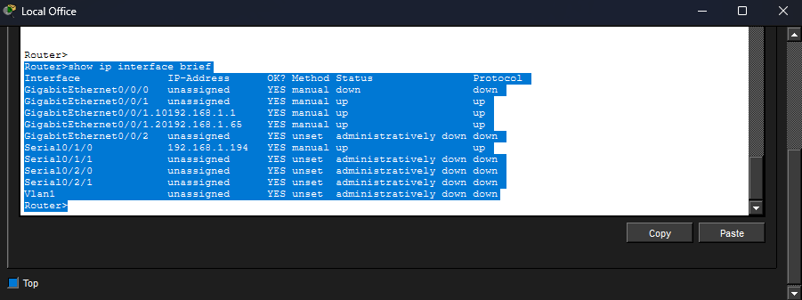

### 6.4. DHCP IP Pool
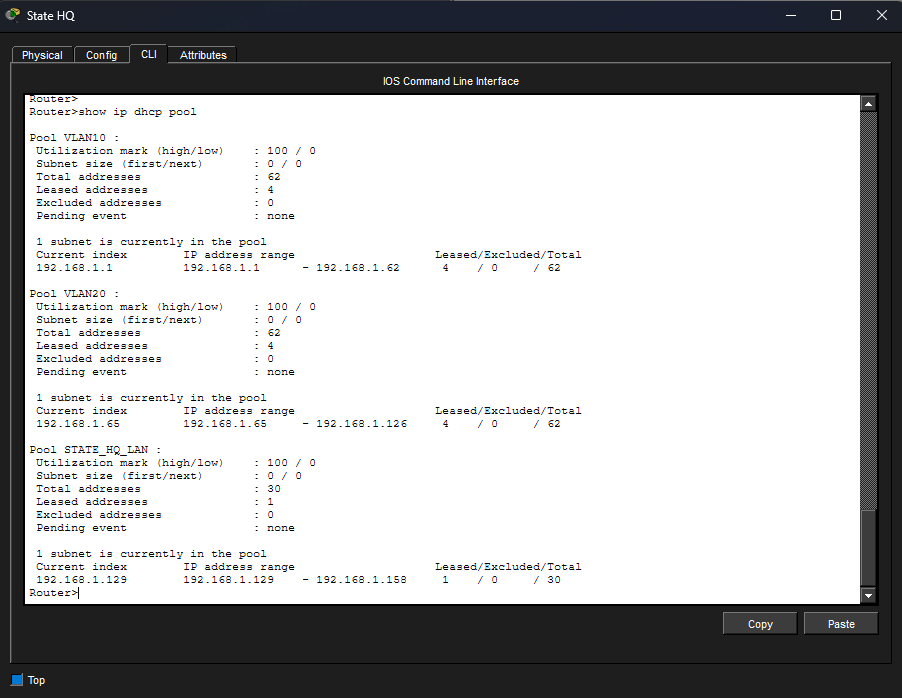

### 6.5. VLAN Brief Table  
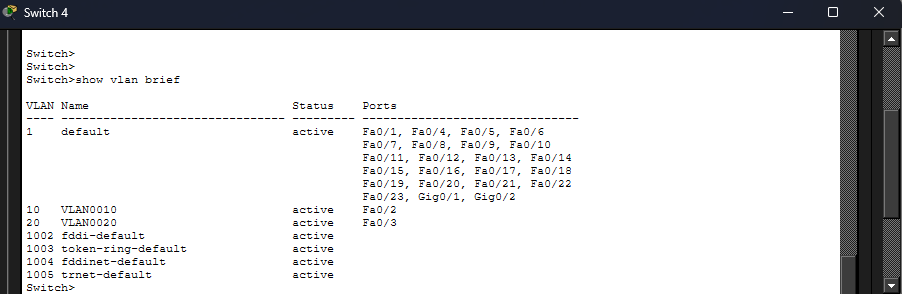

### 6.6. NAT Translation Table 
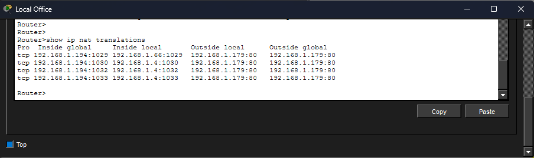

### 6.7. VPN Status 
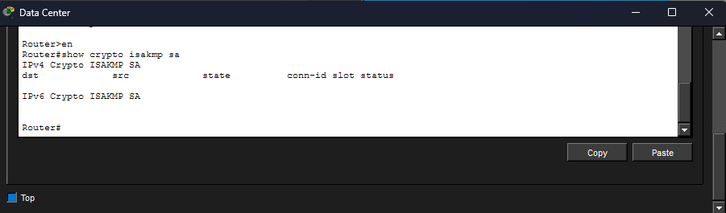
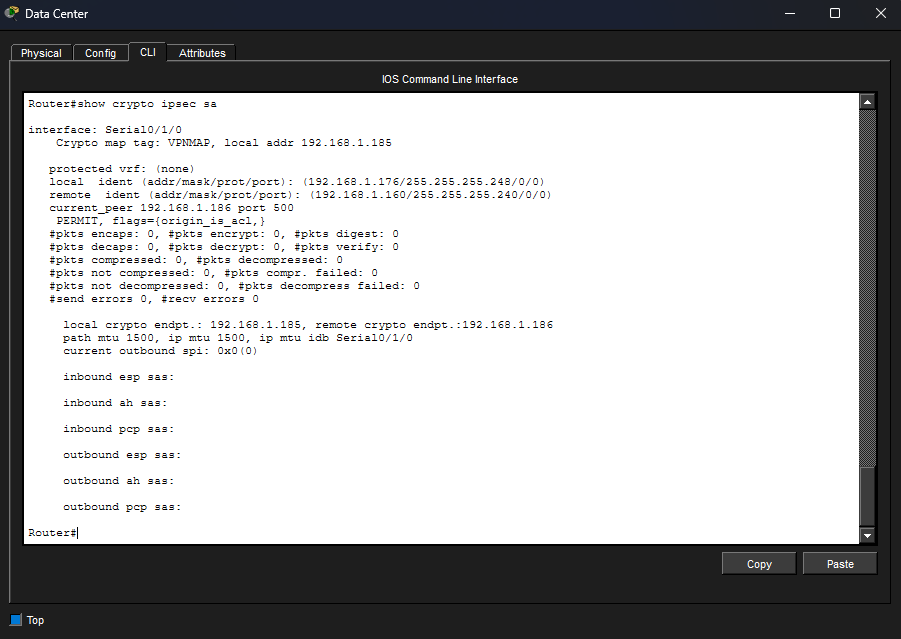

### 6.8. Static Routing
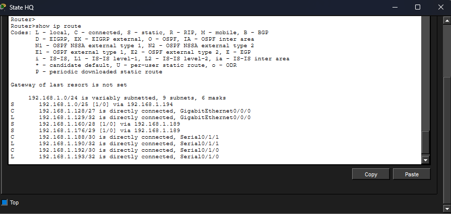
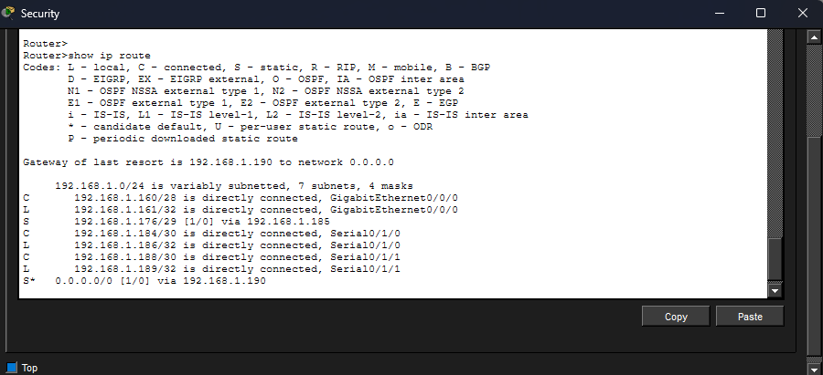

---

<p align="center">
  <strong>FCAI – Capital University ~ (Formerly Helwan University)</strong><br>
  Computer Networks 1 · IT-222 · Final Project · 2025/2026
</p>